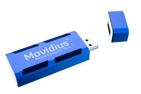

# deepshtick



Movidius Neural compute stick dev tools and notes.

Use the bootstrap tool to fetch the SDK and docs

```
$ python bootstrap.py --help
Usage: bootstrap.py [OPTIONS]

  bootstrap deepshtick development environment

Options:
  --sdk-version TEXT       The movidius SDK version  [default: 1.07.07]
  --folder TEXT            The movidius SDK folder on server  [default:
                           01_07_07]
  --sdk-destination TEXT   The movidius SDK target folder here  [default:
                           ./movidius/sdk/]
  --docs-destination TEXT  The movidius SDK documentation folder here
                           [default: ./movidius/docs/]
  --overwrite              Overwrite existing files  [default: False]
  --help                   Show this message and exit.

```

Leaves a populated folder like so

```
── movidius/
   ├── docs/
   │   ├── MvNC_SDK_1.07.07_ReleaseNotes.txt
   │   ├── NCS_API_1.07.07.pdf
   │   ├── NCS_Getting_Started_1.07.07.pdf
   │   └── NCS_Toolkit_1.07.06.pdf
   └── sdk/
       └── MvNC_SDK_1.07.07.tgz

```


# Resources

* https://ncsforum.movidius.com/discussion/118/movidius-nc-sdk-1-07-07-with-raspberry-pi-support
